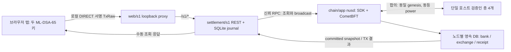

# 현재 구성과 데이터 흐름

[문서 목차](README.md) · [사용자 시작 안내](quickstart.md)

기준: `32781aa97d62ec747e7a25c10fdb8b58030d79f2`. S1은 한 호스트의 테스트 자산 개발망이다.

브라우저는 비밀키를 서버로 보내지 않는다. 공개키 두 개를 새 genesis에 등록한 뒤, 실제 genesis SHA256을 앱·REST·화면에 동일하게 고정한다. REST는 전송 전에 TX 원문과 hash를 journal에 기록하고 서명 bytes를 바꾸지 않는다. 확정 원장은 Chain이며 journal은 로컬 제출 기록이다. journal 유실 후 체인 조회가 가능해도 로컬 제출 목록·브라우저 키가 복원되는 것은 아니다.

예치는 bank DEVQUOTE를 exchange module로 이동하고 사용자 확정 채권을 늘린다. 출금은 확정 채권을 줄여 같은 owner의 bank로 반환한다. 가스 DEVGAS는 별도다. 원자 상태 전이·보존식·epoch 정의는 [S1 계약](../protocol/s1/CONTRACT.md), 실제 구현은 [chain/app](../chain/app/README.md)을 따른다.

| 상태 | 현재 범위 | 한계 |
|---|---|---|
| S0 공통 기반 | rc4 codec·서명·벡터, 모의 정산/API 계약 | 모의 계약을 제품 정산 기능으로 해석하지 않는다 |
| S1 지갑·입출금 | 두 계정, 각 100→40→60, TX·잔고 조회 | 탭 키 복구 없음, 출금 owner 고정 |
| S1 조회·보존 | 영속 원장, 노드/API 재시작, immutable receipt | 잔고 수동 조회, UNKNOWN·stale 구분 필요 |
| S1 개발망 | 동일 호스트 4검증인, 1개 중단 진행·2개 중단 확정 정지·복귀 | 지역 분산·독립 비상 회수·운영 SLA 아님 |
| 미제공 | 주문·매칭·체결 정산·타인 송금·외부 자산 게이트웨이 | S2 등의 설계 목표를 현행 기능으로 표시하지 않는다 |

사용자 TX 서명은 ML-DSA-65이고 합의/P2P 키는 Ed25519다. 체인 전체의 PQ 보장을 뜻하지 않는다. RPC는 신뢰하는 loopback 경계이며 light client 검증이 아니다. 운영 4주소는 서명 키 없는 합성 배분 주소다. 지속 처리량·분산 RPO/RTO·최소 자원은 미측정이다.

원본 아키텍처·개발 설계 PDF와 실제 검증 범위는 [검증 기록](verification.md)을 따른다. `exchange/`와 `settlement/v1/`의 S0 구현/모의 계약은 위 S1 입출금 경로의 주문·매칭·체결 정산 엔진으로 연결되지 않았다.
